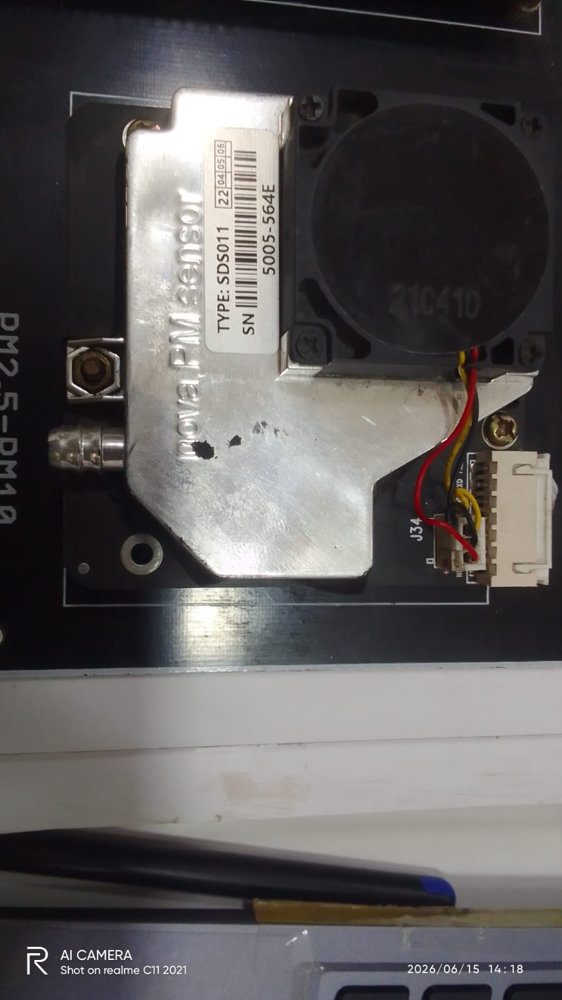
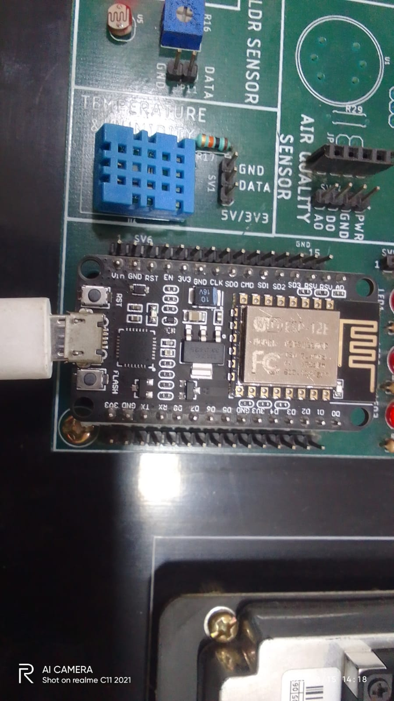
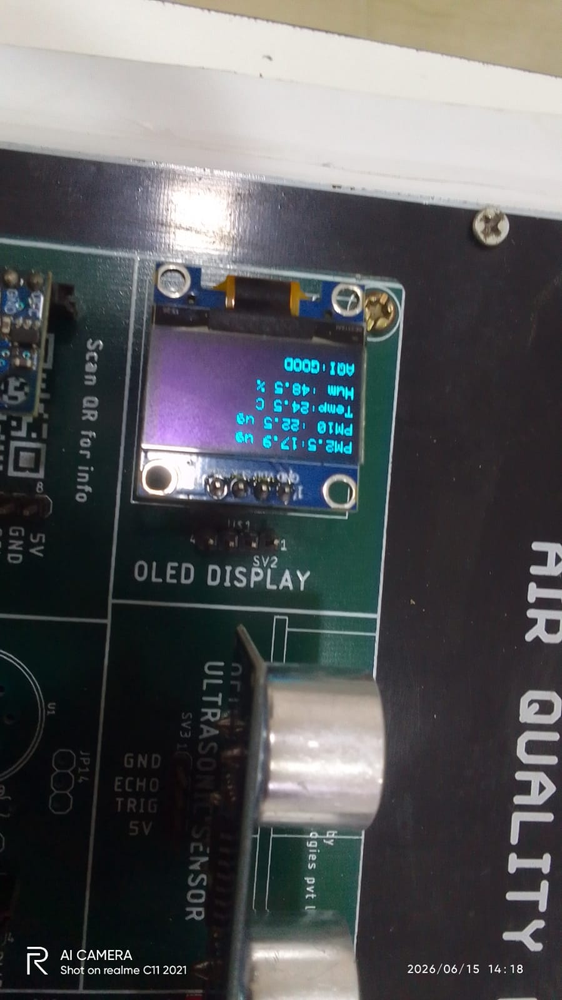
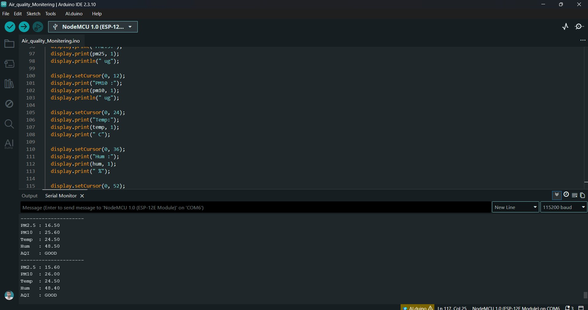

# 🌫️ Air Quality Monitoring System

[](https://www.nodemcu.com/)
[](LICENSE)
[]()

An IoT-based real-time **Air Quality Monitoring System** built using a **NodeMCU ESP8266**, **SDS011** laser PM sensor, **DHT11** temperature/humidity sensor, and an **MQ-135** gas sensor. Live readings — PM2.5, PM10, temperature, humidity, and AQI status — are displayed on a **0.96" OLED screen** and streamed to the Serial Monitor.

---

## 📷 Project Photos

| NodeMCU on Custom PCB | SDS011 PM Sensor | OLED Live Output |
|---|---|---|
|  |  |  |

**Serial Monitor Output:**



---

## 🔧 Hardware Components

| Component | Model | Purpose |
|---|---|---|
| Microcontroller | NodeMCU ESP8266 (ESP-12E) | Main controller + WiFi |
| PM Sensor | Nova SDS011 | Measures PM2.5 & PM10 |
| Temp/Humidity | DHT11 | Temperature & Humidity |
| Air Quality | MQ-135 | Gas / Air quality (analog) |
| Display | 0.96" OLED (I2C, SSD1306) | Shows live readings |
| PCB | Custom Air Quality Board | Sensor integration |

---

## 📌 Pin Connections

| Sensor / Module | Sensor Pin | NodeMCU Pin |
|---|---|---|
| DHT11 | DATA | D4 |
| SDS011 | TX → | D5 (RX) |
| SDS011 | RX ← | D6 (TX) |
| MQ-135 | Analog OUT | A0 |
| OLED SSD1306 | SDA | D2 |
| OLED SSD1306 | SCL | D1 |
| All Sensors | VCC | 3.3V / 5V |
| All Sensors | GND | GND |

---

## ⚙️ Working Principle

- **SDS011** — Laser-based particle sensor; communicates via UART (9600 baud). Each 10-byte data frame (header `0xAA`, tail `0xAB`) is parsed to extract PM2.5 and PM10 values.
- **DHT11** — Single-wire digital sensor providing temperature (0–50°C) and humidity (20–80% RH) readings every 2 seconds.
- **MQ-135** — Metal-oxide gas sensor; analog output proportional to concentration of NH₃, NOₓ, CO₂, alcohol, and benzene.
- **AQI Status** — Calculated from PM2.5 concentration using CPCB (Central Pollution Control Board, India) reference levels.

---

## 📊 AQI Categories (based on PM2.5)

| PM2.5 (µg/m³) | AQI Status | Health Implication |
|---|---|---|
| 0 – 30 | 🟢 GOOD | Satisfactory |
| 31 – 60 | 🟡 MODERATE | Acceptable, minor concern |
| 61 – 90 | 🟠 POOR | Sensitive groups affected |
| 91 – 120 | 🔴 UNHEALTHY | Everyone may be affected |
| > 120 | 🟣 HAZARDOUS | Health warning / emergency |

---

## 📚 Software & Libraries

**Development Environment:** Arduino IDE 2.3.10
**Board Package:** ESP8266 by ESP8266 Community → `NodeMCU 1.0 (ESP-12E Module)`
**Baud Rate:** 115200

Install the following via Arduino Library Manager:

- `Adafruit SSD1306`
- `Adafruit GFX Library`
- `DHT sensor library` by Adafruit
- `SoftwareSerial` (built-in)
- `Wire` (built-in)

---

## 🚀 How to Upload the Code

1. Open `src/Air_Quality_Monitoring.ino` in Arduino IDE.
2. Go to **Tools → Board** and select **NodeMCU 1.0 (ESP-12E Module)**.
3. Select the correct **COM port** under **Tools → Port**.
4. Install the required libraries listed above.
5. Click **Upload**.
6. Open **Serial Monitor** at **115200 baud** to view live readings.

---

## 📟 Sample Output (Serial Monitor)

```
--------------------
PM2.5 : 16.50
PM10  : 25.60
Temp  : 24.50
Hum   : 48.50
AQI   : GOOD
--------------------
PM2.5 : 15.60
PM10  : 26.00
Temp  : 24.50
Hum   : 48.40
AQI   : GOOD
```

---

## 📁 Project Structure

```
AirQualityMonitor/
├── src/
│   └── Air_Quality_Monitoring.ino   # Main Arduino sketch
├── docs/
│   └── Project_Report.docx          # Detailed project report
├── images/                          # Project photos & screenshots
│   ├── NodeMCU_PCB.jpeg
│   ├── SDS011_PM_Sensor.jpeg
│   ├── OLED_Display_Output.jpeg
│   └── Serial_Monitor_Output.png
├── LICENSE
└── README.md
```

---

## 🔭 Future Scope

- Cloud data logging & visualization via **ThingSpeak** or **Firebase**.
- **GSM module (SIM800L)** integration for SMS alerts on critical AQI levels.
- Mobile app (Flutter / MIT App Inventor) for remote monitoring.
- GPS-enabled portable air quality mapping.
- ML-based AQI trend prediction from historical data.

---

## 👨‍💻 Author

**Ramsudarshan Maurya**
B.Tech — Electronics & Communication Engineering (ECE)
Trained at: **Uniconverge Technologies Pvt. Ltd., Noida**
Year: 2026

---

## 📄 License

This project is open-source and available under the [MIT License](LICENSE).
